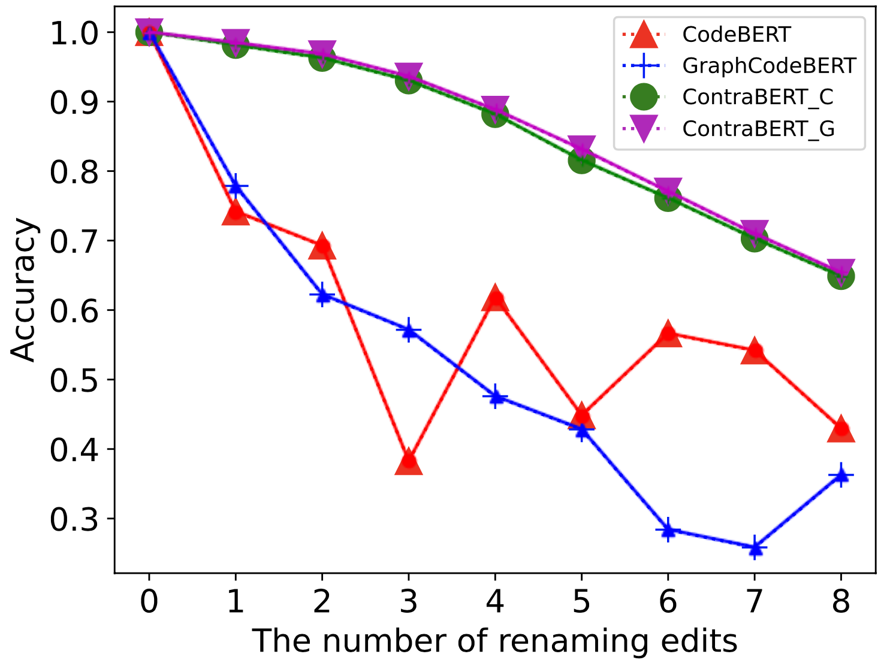
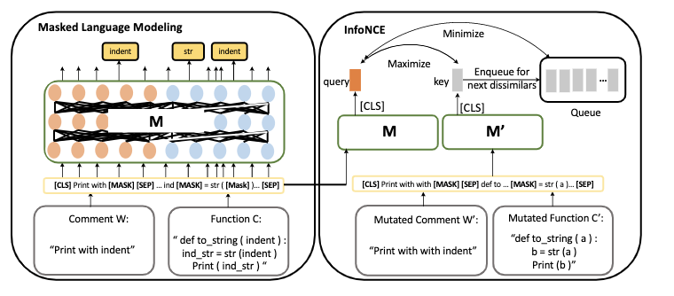

# ContraBERT
This repo is the implementation of the paper "ContraBERT: Enhancing Code Pre-trained Models via Contrastive Learning"
## Motivation
The aforementioned pre-trained models have a profound impact for AI4SE community and have achieved promising results on various tasks. 
However, our preliminary study has demonstrated that state-of-the-art pre-trained models are not robust to a simple label-preserving program mutation such as variable renaming. 
Specifically, we utilize the test data of clone detection (POJ-104)(a task to detect whether two functions are semantic equivalence with different implementations) provided by CodeXGLUE 
and select those samples that are predicted correctly by the pre-trained CodeBERT and GraphCodeBERT. 
Then we randomly rename variables within these programs from 1 to 8 edits. For example, 8 edits mean that we randomly select 8 different variables in a function and rename them for all occurrences with the new generated names. 
We then utilize these newly generated mutated variants to evaluate the model prediction accuracy based on cosine similarity of the embedded vectors of these programs. 
Surprisingly, we find that either CodeBERT or GraphCodeBERT suffers greatly from renaming operation and the accuracy reduces to around 0.4 when renaming edits reach to 8.
It confirms that pre-trained models are not robust to adversarial examples. 

## Model Design
Due to the limitation of current state-of-the-art pre-trained models, we propose to leverage
contrastive learning to improve the model robustness. Specifically, we design a set of different
variants to help the model group the semantic-equivalent variants. The model architecture is shown.

## Experimental Results
Our model is initialized by CodeBERT and GraphCodeBERT, denotes as ContraBERT_C and ContraBERT_G respectively.
By our extensive experiments, we have confirmed the robustness of CodeBERT and GraphCodeBERT has improved. 
We further confirm that these robustness enhanced models can provide improvements on many downstream tasks.
Now we provide the specific commands in each task for the implementation. Our pre-trained models ContraBERT_C and
ContraBERT_G are available at **[ContraBERT_C](https://drive.google.com/drive/u/1/folders/1F-yIS-f84uJhOCzvGWdMaOeRdLsVWoxN)** and **[ContraBERT_G](https://drive.google.com/drive/u/1/folders/1t8VX6aYchpJolbH4mkhK3IQGzyHrDD3C)**.
